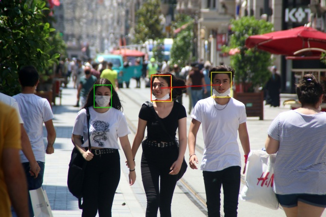
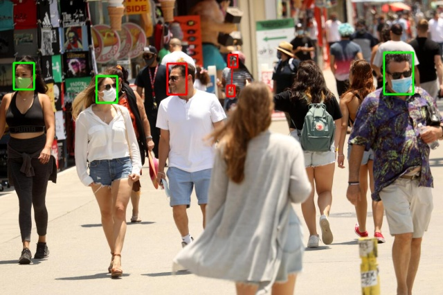

# Face Mask Detection System

## Overview
This Face Mask Detection System is designed to identify individuals wearing masks and detect violations when two people come too close without masks. The model was trained using the DRFMD dataset sourced from Kaggle.

- **With Mask:** Green
- **Without Mask:** Red
- **Incorrect Mask:** Yellow

 
 

## Table 1: DRFMD Dataset Details

|            | Train | Valid | Test | Total |
|------------|-------|-------|------|-------|
| Images     | 10304 | 1474  | 2949 | 14727 |
| Instances  | 20603 | 3052  | 6191 | 29846 |
| Without Mask | 9683  | 1392  | 3082 | 14157 |
| With Mask  | 8926  | 1370  | 2527 | 11590 |
| Wear Mask Incorrect | 1994  | 290   | 582  | 2866  |

The model achieved satisfactory performance after 100 epochs of training using Stochastic Gradient Descent (SGD) with momentum in the YOLOv8 framework.

## Model Summary
- **Total Layers:** 218
- **Total Parameters:** 25,841,497
- **GFLOPs:** 78.7

### Evaluation Metrics
| Class             | Images | Instances | Box(P) | R    | mAP50 | mAP50-95 |
|-------------------|--------|-----------|--------|------|-------|----------|
| all               | 1474   | 3052      | 0.865  | 0.834| 0.893 | 0.602    |
| without_mask      | 660    | 1392      | 0.866  | 0.784| 0.863 | 0.568    |
| with_mask         | 699    | 1370      | 0.902  | 0.856| 0.928 | 0.623    |
| incorrect_mask    | 274    | 290       | 0.825  | 0.863| 0.887 | 0.614    |

## Requirements
To run the project, you need to install the following libraries:
- `opencv-python`
- `ultralytics`
- `torch`

## Functionality
The main idea of the system is to visually indicate when two individuals are too close to each other without wearing masks. This is accomplished by calculating the centroids of detected individuals' bounding boxes. The algorithm checks the heights of the bounding boxes to ensure they are of comparable size, preventing false positives from people of significantly different heights. The Euclidean distance between the centroids is calculated to determine if the individuals are within a predefined threshold. If they are too close, a line is drawn between them to signify a violation.

## Model Path
The trained face mask detection model can be found at `yolov8_training_01/weights/best.pt`.

## File Structure
- `train.py`: Script for training the face mask detection model.
- `test.py`: Script for testing the model's performance on validation data.
- `predict_image.py`: Uses the trained model to make predictions on individual images.
- `predict_video.py`: Applies the model to video files.
- `predict_data/`: Contains sample images and videos for testing.

All metrics and training details can be found in the relevant folders associated with this project.
